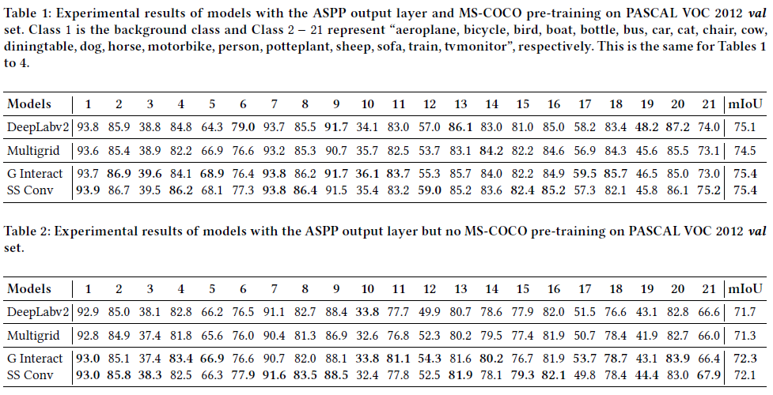
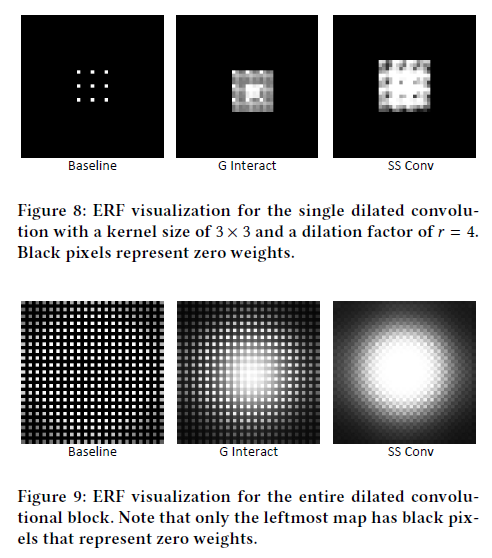

# Smoothed Dilated Convolutions for Improved Dense Prediction

This is the code for reproducing experimental results in our paper "Smoothed Dilated Convolutions for Improved Dense Prediction" accepted for long presentation in KDD2018. 

Created by [Zhengyang Wang](http://www.eecs.wsu.edu/~zwang6/) and [Shuiwang Ji](http://www.eecs.wsu.edu/~sji/) at Washington State University.

In this work, we propose smoothed dilated convolutions to address the gridding artifacts caused by dilated convolutions. Some results are shown below. Our methods improve the image semantic segmentation models, with only hundreds of extra training parameters. More details and experimental results will be added once the paper is published.

**PASCAL mIoU**:


We perform the effective receptive field analysis to visualize the smoothing effect.

**Effective Receptive Field Analysis**:



## Introduction
The baseline is an (re-)implementation of [DeepLab v2 (ResNet-101)](http://liangchiehchen.com/projects/DeepLabv2_resnet.html) in TensorFlow for semantic image segmentation on the [PASCAL VOC 2012 dataset](http://host.robots.ox.ac.uk/pascal/VOC/). We refer to [DrSleep's implementation](https://github.com/DrSleep/tensorflow-deeplab-resnet) (Many thanks!). We do not use tf-to-caffe packages like kaffe so you only need TensorFlow 1.3.0+ to run this code.

The deeplab pre-trained ResNet-101 ckpt files (pre-trained on MSCOCO) are provided by DrSleep -- [here](https://drive.google.com/drive/folders/0B_rootXHuswsZ0E4Mjh1ZU5xZVU). Thanks again!

## Update
**02/09/2018**:
* We implement our proposed smoothed dilated convolutions and insert them in the baseline. To use them, simply change 'dilated_type' in main.py.

**02/02/2018**:

* A clarification:

As reported, ResNet pre-trained models (NOT deeplab) from Tensorflow were trained using the channel order RGB instead BGR (https://github.com/tensorflow/models/blob/master/research/slim/preprocessing/vgg_preprocessing.py).

Thus, the most correct way to apply them is to use the same order RGB. The original code is for pre-trained models from Caffe and uses BGR. To correct this, when you use [res101](http://download.tensorflow.org/models/resnet_v1_101_2016_08_28.tar.gz) and [res50](http://download.tensorflow.org/models/resnet_v1_50_2016_08_28.tar.gz), you need to delete [line 116](https://github.com/zhengyang-wang/Deeplab-v2--ResNet-101--Tensorflow/blob/1b449b22a0729767b370c68a2848fda9caeed510/utils/image_reader.py#L116) and [line 117](https://github.com/zhengyang-wang/Deeplab-v2--ResNet-101--Tensorflow/blob/1b449b22a0729767b370c68a2848fda9caeed510/utils/image_reader.py#L117) in utils/image_reader.py to remove the RGB to BGR step when reading images. Then, modify [line 77](https://github.com/zhengyang-wang/Deeplab-v2--ResNet-101--Tensorflow/blob/1b449b22a0729767b370c68a2848fda9caeed510/utils/label_utils.py#L77) in utils/label_utils.py to remove the BGR to RGB step in the inverse process for image visualization. At last, you need to change the IMAGE_MEAN by swapping the first and the third values in [line 26](https://github.com/zhengyang-wang/Deeplab-v2--ResNet-101--Tensorflow/blob/1b449b22a0729767b370c68a2848fda9caeed510/model.py#L26) and [line 26](https://github.com/zhengyang-wang/Deeplab-v2--ResNet-101--Tensorflow/blob/1b449b22a0729767b370c68a2848fda9caeed510/model_msc.py#L26) for non_msc and msc training, respectively.

However, this change actually does not affect the performance a lot, proved by discussion in [issue 30](https://github.com/zhengyang-wang/Deeplab-v2--ResNet-101--Tensorflow/issues/30). In this task, the size of training patches is different from that in ImageNet. And the set of images is different. The IMAGE_MEAN is never accurate. I guess that simply using IMAGE_MEAN=[127.5, 127.5, 127.5] will work as well.

**12/13/2017**:

* Now the test code will output the mIoU as well as the IoU for each class.

**12/12/2017**:

* Add 'predict' function, you can use '--option=predict' to save your outputs now (both the true prediction where each pixel is between 0 and 20 and the visual one where each class has its own color).

* Add multi-scale training, testing and predicting. Check main_msc.py and model_msc.py and use them just as main.py and model.py.

* Add plot_training_curve.py to use the log.txt to make plots of training curve.

* Now this is a 'full' (re-)implementation of [DeepLab v2 (ResNet-101)](http://liangchiehchen.com/projects/DeepLabv2_resnet.html) in TensorFlow. Thank you for the support. You are welcome to report your settings and results as well as any bug!

**11/09/2017**:

* The new version enables using original ImageNet pre-trained ResNet models (without pre-training on MSCOCO). You may change arguments ('encoder_name' and 'pretrain_file') in main.py to use corresponding pre-trained models. The original pre-trained ResNet-101 ckpt files are provided by tensorflow officially -- [res101](http://download.tensorflow.org/models/resnet_v1_101_2016_08_28.tar.gz) and [res50](http://download.tensorflow.org/models/resnet_v1_50_2016_08_28.tar.gz).

* To help those who want to use this model on the CityScapes dataset, I shared the corresponding txt files and the python file which generates them. Note that you need to use tools [here](https://github.com/mcordts/cityscapesScripts) to generate labels with trainID first. Hope it would be helpful. Do not forget to change IMG_MEAN in model.py and other settings in main.py.

* 'is_training' argument is removed and 'self._batch_norm' changes. Basically, for a small batch size, it is better to keep the statistics of the BN layers (running means and variances) frozen, and to not update the values provided by the pre-trained model by setting 'is_training=False'. Note that is_training=False still updates BN parameters gamma (scale) and beta (offset) if they are presented in var_list of the optimiser definition. Set 'trainable=False' in BN fuctions to remove them from trainable_variables.

* Add 'phase' argument in network.py for future development. 'phase=True' means training. It is mainly for controlling batch normalization (if any) in the non-pre-trained part.
```
Example: If you have a batch normalization layer in the decoder, you should use 

outputs = self._batch_norm(inputs, name='g_bn1', is_training=self.phase, activation_fn=tf.nn.relu, trainable=True)
```
* Some changes to make the code more readable and easy to modify for future research.

* I plan to add 'predict' function to enable saving predicted results for offline evaluation, post-processing, etc.

## System requirement

#### Programming language
```
Python 3.5
```
#### Python Packages
```
tensorflow-gpu 1.3.0
```
## Configure the network

All network hyperparameters are configured in main.py.

#### Training
```
num_steps: how many iterations to train

save_interval: how many steps to save the model

random_seed: random seed for tensorflow

weight_decay: l2 regularization parameter

learning_rate: initial learning rate

power: parameter for poly learning rate

momentum: momentum

encoder_name: name of pre-trained model: res101, res50 or deeplab

pretrain_file: the initial pre-trained model file for transfer learning

dilated_type: type of dilated conv: regular, decompose, smooth_GI or smooth_SSC

data_list: training data list file
```
#### Testing/Validation
```
valid_step: checkpoint number for testing/validation

valid_num_steps: = number of testing/validation samples

valid_data_list: testing/validation data list file
```
#### Prediction
```
out_dir: directory for saving prediction outputs

test_step: checkpoint number for prediction

test_num_steps: = number of prediction samples

test_data_list: prediction data list filename

visual: whether to save visualizable prediction outputs
```
#### Data
```
data_dir: data directory

batch_size: training batch size

input height: height of input image

input width: width of input image

num_classes: number of classes

ignore_label: label pixel value that should be ignored

random_scale: whether to perform random scaling data-augmentation

random_mirror: whether to perform random left-right flipping data-augmentation
```
#### Log
```
modeldir: where to store saved models

logfile: where to store training log

logdir: where to store log for tensorboard
```
## Training and Testing

#### Start training

After configuring the network, we can start to train. Run
```
python main.py
```
The training of Deeplab v2 ResNet will start.

#### Training process visualization

We employ tensorboard for visualization.

```
tensorboard --logdir=log --port=6006
```

You may visualize the graph of the model and (training images + groud truth labels + predicted labels).

To visualize the training loss curve, write your own script to make use of the training log.

#### Testing and prediction

Select a checkpoint to test/validate your model in terms of pixel accuracy and mean IoU.

Fill the valid_step in main.py with the checkpoint you want to test. Change valid_num_steps and valid_data_list accordingly. Run

```
python main.py --option=test
```

The final output includes pixel accuracy and mean IoU.

Run

```
python main.py --option=predict
```
The outputs will be saved in the 'output' folder.
